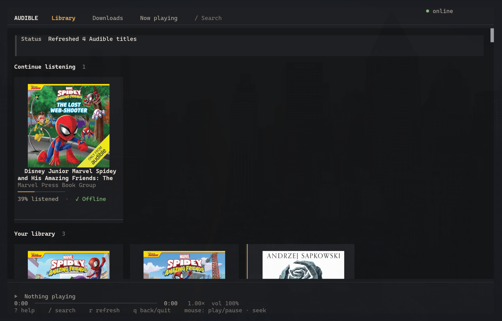
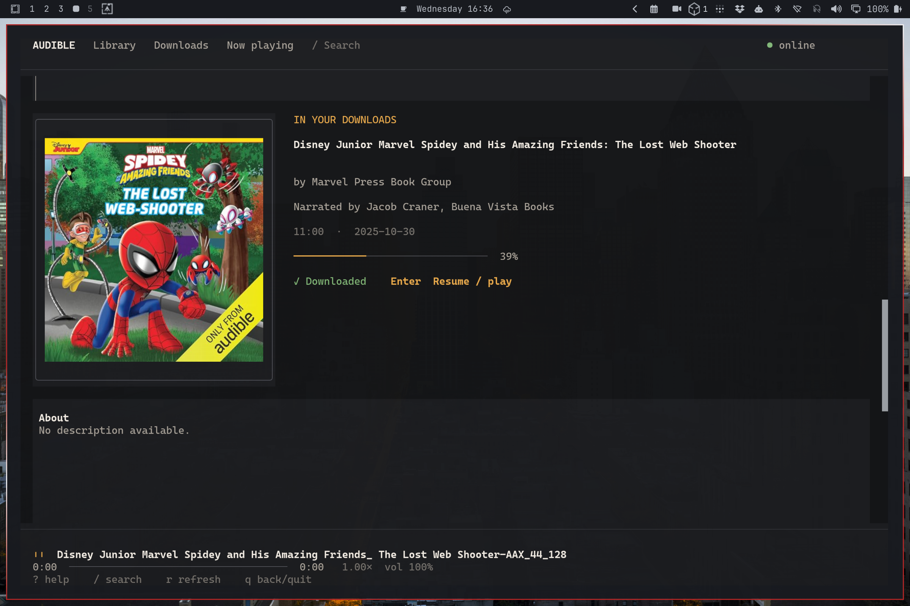
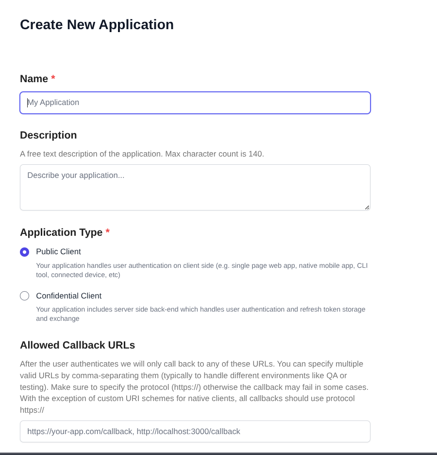
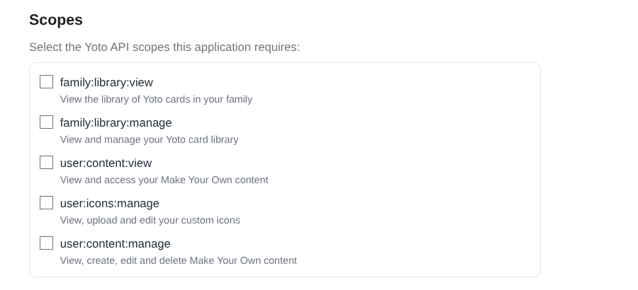
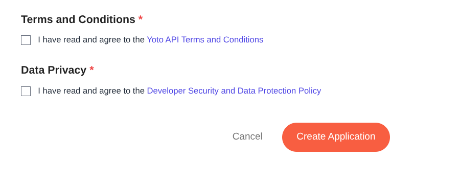

# Auditui

Auditui is a Linux-first terminal audiobook application with a native Zig engine
and a Bun/OpenTUI interface. Audible provides the full offline workflow, while
Yoto support reads MYO and family-group content through Yoto's public API and
streams it behind the same library and player experience.

Its implemented application path includes native browser authentication,
automatic library refresh, search, durable resumable AAXC downloads, cover and
metadata caching, persistent playback state, and supervised mpv playback.
Audible's private API can change without notice; account tests remain opt-in and
are never run in CI.

## Screenshots

### Library



### Title details and player



### Omarchy integration

The optional [Auditui Now Playing plugin](https://github.com/JonathanRiche/omarchy-auditui)
adds the current title, chapter, progress, and playback controls to the Omarchy bar.

## Install

Install the latest Linux x86_64 release directly from GitHub:

```sh
curl -fsSL https://raw.githubusercontent.com/JonathanRiche/auditui/main/install.sh | sh
```

Then connect the Audible provider and launch Auditui:

```sh
auditui auth login
auditui
```

The default marketplace is the United States. Pass another marketplace when
needed, for example `auditui auth login --country-code ca` for Canada. Add
`--no-encryption` to use a private mode-`0600` credential file without recurring
passphrase prompts. Auditui requires `mpv` for playback and `sqlite3` for durable
non-secret state.

### Connect Yoto

Open the [Yoto developer dashboard](https://dashboard.yoto.dev/), choose
**Create New Application**, and complete the form as follows:

1. Enter `Auditui` as the name. A suitable description is
   `A terminal interface for browsing and playing Audible and Yoto libraries.`
2. Choose **Public Client**. Auditui is a local PKCE client and must not be
   configured with or given a client secret.
3. Set **Allowed Callback URLs** to exactly
   `http://127.0.0.1:8787/callback`.



Leave **Allowed Logout URLs**, **Application Logo**, and **Application Privacy
Policy URL** empty for local development. They can be filled with real hosted
URLs before applying for Yoto verification.

4. Under **Scopes**, select:
   - `family:library:view`
   - `user:content:view`
   - `offline_access`, if the dashboard offers it

`offline_access` lets Yoto issue a refresh token so you do not have to sign in
again every day. If your application has not been approved for it, Yoto
reports "scopes that have not been pre-approved: offline_access"; Auditui then
automatically reconnects without it and asks you to sign in again when the
session expires. Do not select either `manage` scope or `user:icons:manage`;
Auditui does not need write access.



5. Read and accept **Terms and Conditions** and **Data Privacy**, then choose
   **Create Application**.



After creation, copy the displayed **Client ID** into this single command—no
`.env` file or shell export is needed:

```sh
auditui auth login --provider yoto --client-id YOUR_CLIENT_ID
auditui
```

The developer-dashboard account may use a different email, but browser login
must use an adult account belonging to the Yoto family whose library you want
to access. Auditui asks Yoto to show a fresh login instead of silently reusing
the dashboard session. Unverified applications are supported; explicitly
accept Yoto's unverified-app warning on the consent screen.

That login command performs the first library refresh and stores the public
client ID with the private account credentials. Future refreshes and launches
do not need the ID again. For a second account, add `--account NAME` to the same
command. See the [Yoto provider guide](docs/yoto-provider.md) for the supported
content surface and current limitations.

The installer downloads the release archive and checksum from GitHub Releases,
verifies it, and installs `auditui` under `~/.local/bin`. It never needs Git,
Zig, Bun, Mise, or root access. When needed, it detects Bash, Zsh, or Fish and
adds `~/.local/bin` to that shell's startup configuration without creating an
alias. Follow the printed `source` command or open a new terminal to activate
the updated PATH. Set `AUDITUI_INSTALL_PREFIX` to choose another prefix; custom
prefixes print a PATH instruction instead of editing shell configuration.

### Omarchy bar widget

On [Omarchy](https://omarchy.org), the
[omarchy-auditui](https://github.com/JonathanRiche/omarchy-auditui) bar widget
shows the current title, chapter, and progress while something is playing and
hides itself otherwise:

```sh
omarchy plugin add https://github.com/JonathanRiche/omarchy-auditui.git --enable
```

It is driven by `auditui player status` (one JSON line, `{"state":"stopped"}`
when Auditui is not playing) and `auditui player toggle|pause|play|next|previous|forward|back [SECS]`.
That output carries display metadata only, never media sources or credentials.

## Develop from source

```sh
mise install
mise run root:install
mise run tui:install
mise run test
mise run tui:start
```

Development uses [mise](https://mise.jdx.dev/) to install the pinned Zig and Bun
versions. Run `mise run release:check` before publishing. See the
[release guide](docs/releasing.md) for the tag-driven workflow.

For Yoto development, create a dashboard Public Client with
`http://127.0.0.1:8787/callback`, then use the matching Mise tasks. Arguments
after `--` are passed to the native Zig CLI:

```sh
mise run yoto:connect -- --client-id YOUR_CLIENT_ID
mise run yoto:refresh
mise run yoto:list
mise run tui:start
```

For a named account, append `--account kids-room` to each Yoto command. The
client ID is needed only by `yoto:connect`; Auditui stores it for subsequent
refreshes.

Purchased Yoto cards appear only when they are in a Library group: in the Yoto
app open *Library*, create a group (for example "Auditui"), add the cards, then
run `mise run yoto:refresh`. Yoto's public API has no endpoint that lists every
purchased card directly; Make Your Own cards are always included.

Connect an Audible account in the external browser, then populate the local
library cache. The default encrypted profile asks for its passphrase in both
commands:

```sh
auditui auth login --profile default --country-code us
auditui library refresh
auditui
```

Provider-specific refreshes can be run explicitly. Named Yoto accounts use
`--account`; Audible retains its compatible `--profile` terminology:

```sh
auditui library refresh --provider audible --profile default
auditui library refresh --provider yoto --account default
```

The same secure flows are available without leaving the app. Press `a` on the
empty Library screen to connect an account, or press `r` with an encrypted
profile to refresh it. The TUI temporarily yields the controlling terminal to
the native CLI, which reads the passphrase with echo disabled, then restores
the interface. Passphrases never travel through RPC, command arguments, logs,
or application state.

To match Python Audible's optional unencrypted auth-file mode and avoid
passphrase prompts, use `auditui auth login --no-encryption`. This still uses
an atomic owner-only `0600` file inside a private `0700` directory, but anyone
who gains access as your OS user can read its credentials. Encryption remains
the default.

The refresh is read-only with respect to the Audible account. It requests the
owned library, paginates through every result, and atomically replaces the
mode-`0600` local cache only after all returned pages validate. Requests use
Audible's access-token header over HTTPS; rejected or expiring tokens are
rotated once and credentials are never logged.

In the TUI, select a title and press `d` to obtain its offline license and
download it. The license voucher and media file are stored owner-only under
the XDG data directory; signed URLs and playback keys never appear in RPC or
logs. Downloads are queued asynchronously with two-worker bounded concurrency,
real byte progress, cancellation, resumable `.part` files, and persistent job
status across restarts. Available cover/PDF metadata is saved beside the media
with a non-secret metadata JSON sidecar. Press Enter on a downloaded title to play it. Protected AAXC keys are
derived in memory and passed to mpv over its private Unix socket. Cover art is
shown on the detail screen using native Kitty/Sixel graphics when the terminal
supports them, with a colored block/ASCII fallback otherwise. The packaged
launcher includes the OpenTUI 0.5.x OSC 66 workaround needed for native images in
current Ghostty/Kitty terminals. OpenTUI's negotiated file-backed Kitty
transport keeps large inline pixel streams out of the terminal parser and owns
placement acknowledgements and cleanup. Set `AUDIBLE_TUI_IMAGE_PROTOCOL=blocks`
to force the portable fallback.

`auditui` is the single user-facing launcher. It stays in the user's current
terminal and enables full-resolution covers automatically when supported:

```sh
auditui
```

For terminals without native image support,
`AUDIBLE_TUI_IMAGE_PROTOCOL=blocks auditui` uses portable block artwork.

On Omarchy, the interface automatically maps the active
`$XDG_STATE_HOME/omarchy/current/theme/colors.toml` palette to all application
surfaces, text, borders, focus states, and status colors. Theme changes are
picked up while the app is running, including atomic `omarchy theme set`
updates. Outside Omarchy the built-in Audible palette remains the fallback.
Set `AUDIBLE_TUI_THEME=default` to opt out, or
`AUDIBLE_TUI_THEME_FILE=/path/to/colors.toml` to use another compatible flat
Omarchy palette.

The interface is keyboard- and mouse-accessible. Press `Ctrl+p` for the command
palette or `?` for the complete shortcut reference. Number keys `1`–`5` open
Library, Wishlist, Downloads, Now Playing, and Settings; `/` searches from any
screen. Wishlist additions and removals always require confirmation. Failed or
cancelled transfers can be resumed with `r` from Downloads. Now Playing exposes
bookmarks (`b`/`x`), sleep timers (`s`), volume (`+`/`-`), speed, seek, and
chapter controls. Navigation labels compact automatically in narrow terminals,
and large libraries use a bounded render window while retaining the complete
collection for keyboard navigation and search.

Set `AUDIBLE_TUI_MONOCHROME=1` (or the conventional `NO_COLOR` variable) for a
high-contrast monochrome palette. Selection and status never rely on color
alone: borders, markers, symbols, and text labels remain visible.

Until live Audible authentication is configured, the application can operate as a
local audiobook shelf. Point it at a directory of `.m4b`, `.mp3`, `.m4a`,
`.ogg`, `.opus`, `.flac`, `.wav`, `.aax`, or `.aaxc` files:

```sh
AUDIBLE_LIBRARY_DIR=/absolute/path/to/audiobooks auditui
```

The scan is non-recursive and does not open or modify media. Items are passed
to `mpv` as argument-list entries, never through a shell. Direct AAX/AAXC
playability depends on the local mpv build and legitimately obtained account
material.

Run the engine directly:

```sh
mise run zig:build
engine/zig-out/bin/audible-zig internal health
engine/zig-out/bin/audible-zig internal rpc
```

RPC input is one JSON object per line. Human diagnostics go to stderr and JSON
responses/events go to stdout. Set `AUDIBLE_CONFIG_DIR`, `AUDIBLE_DATA_DIR`,
`AUDIBLE_STATE_DIR`, or `AUDIBLE_CACHE_DIR` to isolate application data.

## Security and account safety

Only use this software with content associated with your account and comply
with Audible's terms and applicable law. Credential files must be mode `0600`
inside a mode `0700` directory. The application must not log tokens, cookies,
device keys, activation bytes, vouchers, or signed download URLs. No purchasing,
credit use, or cloud mutation is part of normal operation.

See [the architecture](docs/architecture.md), [protocol](docs/protocol.md),
[authentication notes](docs/authentication.md), and [threat model](docs/threat-model.md).

## Status

The [compatibility manifest](docs/compatibility-manifest.json) is the source of
truth for implemented Python `audible-cli` 0.6.0 behavior. Application
readiness and command-line drop-in parity are separate claims: the native app
can be usable while a manifest entry remains a documented deviation.

## License

AGPL-3.0-only. This project is behaviorally derived from `audible-cli` and
the Python `audible` package; see `NOTICE` and `docs/upstream-baseline.md`.
